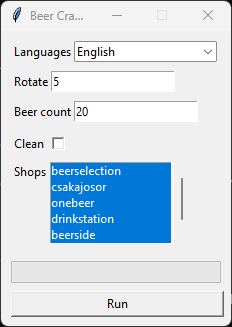

# Beer Crawler
An easy to use script to always know what new beers your local craft beer shops offer.

## Structure
Each shop has it's own module which is called by the main script `main.py`. The main script collects all the new beer objects and creates a workbook from them under the `report` folder. The name of the workbook is the timestamp when it was created using the following format `"%d-%m-%Y_%H-%M-%S".xlsx`, like: `29-09-2023_21-59-47.xlsx`. The only exception is the `common.py` module which contains functions used by multiple modules. 

## Modules
Each module should only crawl one shop page and then return a dictionary of new `beer` objects with the name of the shop as key. The new objects are determined by comparing the new list with the already present json file, which is also saved by the module under the `json` folder. If the json file is not present (e.g.: first run) all the object will be returned to the main script. From this the `common.py` module is an exception.
- `common.py`: Collection of functions used by other modules.
- `beerbox.py`: Crawler for [Beerbox](https://beerbox.hu/).
- `beerselection.py`: Crawler for [Beerselection](https://www.beerselection.hu/).
- `beerside.py`: Crawler for [Beerside](https://www.beerside.hu/).
- `csakajosor.py`: Crawler for [Csak a jó sör](https://www.csakajosor.hu/).
- `drinkstation.py`: Crawler for [Drink Station](https://drinkstation.hu/).
- `onebeer.py`: Crawler for [One Beer](https://onebeer.hu/).

## Language
Currently supported languages:
- English
- Hungarian

## Arguments
- `--language` or `-l`: Use this to set the language, currently supported values: `en`, `hu`. By default english is used.
- `--shop` or `-s`: Use this to set the shops you want to crawl, this is a comma separated list. Example: `beerselection,csakajosor`, currently supported values: `beerselection,csakajosor,onebeer,drinkstation,beerside,beerbox`. By default all the shops are checked.
- `--version` or `-v`: Prints the version of the script and exits.
- `--rotate` or `-r`: The script will keep the set number of newest files in the log & report folder and delete the others. To disable this feature set the value lower than zero. By default the script will keep 5 of the newest files.
- `--clean` or `-c`: Deletes all files from the log, report and json folders then exits.
- `--gui` or `-g`: Starts the application in the GUI mode.
- `--daily` or `-d`: Only let's the script run one time per day.
- `--beercount` or `-b`: The amount of beer to check in each shop. By default the script will check up to 20 beers.

## Requirements
- Python 3.10+
- The following python packages: `requests` `html5lib` `lxml` `beautifulsoup4` `XlsxWriter`.

## Execution
You can use the script directly: `python ./main.py` or use the [docker image](https://hub.docker.com/r/kreutzakos/beercrawler).

## GUI
> [!IMPORTANT]  
> The GUI mode is not supported in the docker images.

When using the `--gui` option, the following window will pop-up.

  </img>

